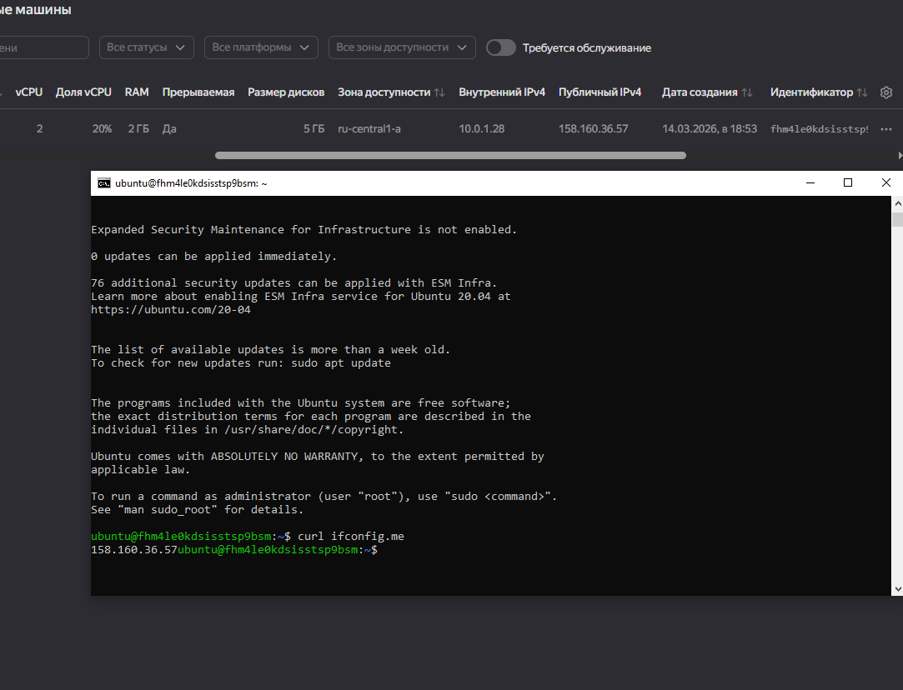

# Задание №1

## 
скриншот ЛК Yandex Cloud с созданной ВМ, где видно внешний ip-адрес;
скриншот консоли, curl должен отобразить тот же внешний ip-адрес;

1. Синтаксические ошибки в коде
    Неправильный platform_id
    опечатка в слове standard.
2. SSH переменная
    В variables.tf объявлена переменная: "vms_ssh_root_key". Но в задании написано использовать: vms_ssh_public_root_key
3. metadata ssh-keys
    Ошибка var.vms_ssh_root_key

4. Ответ на вопрос:
   1. preemptible = true - параметр конфигурации, который создает прерываемую виртуальную машину. Может быть принудительно остановлена облачным провайдером (через 24 часа ил и при нехватке ресурсов). Снижает стоимость использования ВМ.
   2. core_fraction= - параметр конфигурации, который создает прерываемую виртуальную машину с пониженной производительностью процессора. Дешевый тип ВИ, используемый для тестирования.